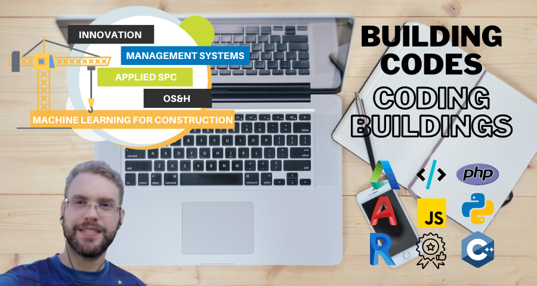

# :construction_worker: Vinicius Centurion
Hi, I'm Centurion. A civil engineer passionate about programming, automation, IoT. I am always looking for new ways to make everyday activities easier for my co-workers, employees and suppliers.

So i decided: I should get a Computer Science bachelor's degree and try to develop applications that make construction management tasks less time consuming and stressful.

Note that I'm still learning new programming languages and computer concepts, so keep your expectations low while I search for knowledge at the university. And feel free to collaborate on projects, to chat or share ideas.
